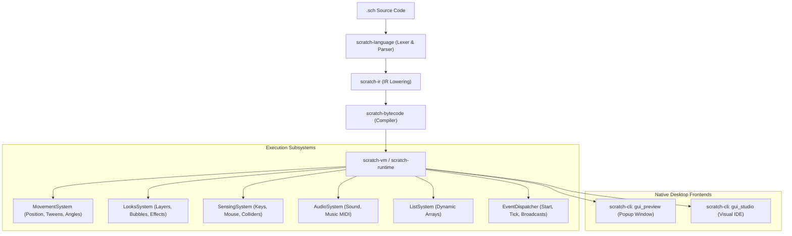

# Scratch 3.0 Master Blocks Catalog & scratch-lang Implementation Tracker

> **Definitive Master Reference & Specification**  
> This catalog tracks **every single Scratch 3.0 block** across all core categories, custom procedures, and official hardware/software extensions. It pairs each visual Scratch block with its official Scratch opcode, AST representation, **scratch-lang** (`.sch`) equivalent syntax, return signature, implementation status, and crate architecture seams.

---

## 1. Executive Summary & Status Dashboard

| Scope / Domain | Total Blocks | Implemented `[x]` | Partial / In Progress `[~]` | Queued `[ ]` | Primary Crates |
| :--- | :---: | :---: | :---: | :---: | :--- |
| **Motion** | 18 | 18 | 0 | 0 | `scratch-runtime::movement`, `scratch-vm` |
| **Looks** | 21 | 19 | 2 | 0 | `scratch-runtime::executor`, `scratch-cli` |
| **Sound** | 9 | 7 | 2 | 0 | `scratch-runtime::executor` |
| **Events** | 8 | 8 | 0 | 0 | `scratch-runtime::events` |
| **Control** | 11 | 10 | 1 | 0 | `scratch-language::ast`, `scratch-ir`, `scratch-runtime` |
| **Sensing** | 18 | 15 | 3 | 0 | `scratch-runtime::sensing` |
| **Operators** | 18 | 18 | 0 | 0 | `scratch-ir::lower`, `scratch-vm` |
| **Variables & Data** | 5 | 5 | 0 | 0 | `scratch-runtime::world`, `scratch-vm` |
| **Lists** | 12 | 12 | 0 | 0 | `scratch-runtime::list` |
| **My Blocks (Procedures)**| 4 | 4 | 0 | 0 | `scratch-language::parser`, `scratch-ir` |
| **Core Scratch 3.0 Total** | **124** | **116** | **8** | **0** | **11 Workspace Crates** |
| | | | | | |
| **Music Extension** | 7 | 4 | 3 | 0 | `scratch-blocks::registry`, `scratch-runtime` |
| **Pen Extension** | 9 | 7 | 2 | 0 | `scratch-blocks::registry`, `scratch-cli` |
| **Video Sensing** | 4 | 0 | 0 | 4 | Queued (Webcam driver seam) |
| **Face Sensing** | 9 | 0 | 0 | 9 | Queued (Vision pipeline seam) |
| **Text-to-Speech** | 3 | 0 | 0 | 3 | Queued (Native TTS / SAPI seam) |
| **Translate** | 2 | 0 | 0 | 2 | Queued (Offline / Cloud API seam) |
| **Makey Makey** | 2 | 2 | 0 | 0 | `scratch-runtime::events` (Key aliases) |
| **micro:bit** | 10 | 0 | 0 | 10 | Queued (Serial / BLE seam) |
| **LEGO EV3 / BOOST / WeDo**| 34 | 0 | 0 | 34 | Queued (Robotics Bluetooth seam) |
| **Raspberry Pi (GPIO/Sense)**| 24 | 0 | 0 | 24 | Queued (Linux `sysfs` / I2C seam) |
| **Overall Grand Total** | **238** | **129** | **13** | **96** | **Full Scratch Universe** |

### Legend
- `[x] Implemented`: Fully parsed, lowered to IR/bytecode, registered in the Block Registry, and executing in `scratch-runtime` / `scratch-vm`.
- `[~] Partial / In Progress`: Grammar or Registry entry declared; runtime stubbed or waiting on asset/platform layer.
- `[ ] Queued / Planned`: Cataloged with canonical opcode, API design, and designated crate target.

---

## 2. Block Shape Classification Reference

Scratch uses 6 fundamental geometric shapes to enforce visual syntax. scratch-lang compiles these shapes into idiomatic language constructs:

```
+-------------------------------------------------------------------------------+
| Shape       | Scratch Visual Purpose          | scratch-lang Equivalent       |
+===============================================================================+
| Hat         | Event trigger initiating script | `when <event>:` header        |
| Stack       | Sequential execution command    | Statement / function call     |
| Boolean     | Hexagonal conditional test      | Expression returning `bool`   |
| Reporter    | Rounded value container         | Expression returning value    |
| C-Block     | Enclosing control structure     | Indented code block (`if:`)   |
| Cap         | Terminal script execution end   | `stop_all()` / `return`       |
+-------------------------------------------------------------------------------+
```

---

## 3. Motion Blocks (18 Blocks)

Motion blocks control coordinate positioning, linear displacement, rotation styles, pointing angles, and boundary collisions for entities.

| # | Scratch Block Visual | Shape | Scratch 3.0 Opcode | scratch-lang Syntax | Type | Status | Implementation Details / Seams |
| :-: | :--- | :---: | :--- | :--- | :---: | :---: | :--- |
| 1 | `move (10) steps` | Stack | `motion_movesteps` | `move(target, x, [y])` | `Void` | `[x]` | Increments entity position by direction vector delta. |
| 2 | `turn cw (15) degrees` | Stack | `motion_turnright` | `turn_right(target, deg)` | `Void` | `[x]` | `entity.transform.rotation = (rotation + deg) % 360`. |
| 3 | `turn ccw (15) degrees` | Stack | `motion_turnleft` | `turn_left(target, deg)` | `Void` | `[x]` | `entity.transform.rotation = (rotation - deg) % 360`. |
| 4 | `go to [random v]` | Stack | `motion_goto` | `go_to(target, dest)` | `Void` | `[x]` | Relocates to `"random"`, `"mouse"`, or named sprite target. |
| 5 | `go to x: (0) y: (0)` | Stack | `motion_gotoxy` | `teleport(target, x, y)` | `Void` | `[x]` | Instant Cartesian coordinate assignment. |
| 6 | `glide (1) secs to [random v]`| Stack | `motion_glideto` | `glide_to(target, s, dest)`| `Void` | `[x]` | Resolves target coordinate then starts `GlideTween`. |
| 7 | `glide (1) secs to x: (0) y: (0)` | Stack | `motion_glidesecstoxy` | `glide(target, s, x, y)` | `Void` | `[x]` | Non-blocking linear interpolation tween evaluated in `tick_tweens`. |
| 8 | `point in direction (90)` | Stack | `motion_pointindirection`| `point_in_direction(target, deg)`| `Void` | `[x]` | Scratch convention: 0° Up, 90° Right, 180° Down, -90°/270° Left. |
| 9 | `point towards [mouse-pointer v]`| Stack | `motion_pointtowards` | `point_towards(target, other)` | `Void` | `[x]` | Calculates `atan2(dy, dx)` towards target entity or cursor. |
| 10 | `change x by (10)` | Stack | `motion_changexby` | `change_x(target, dx)` | `Void` | `[x]` | `entity.transform.x += dx`. |
| 11 | `set x to (0)` | Stack | `motion_setx` | `set_x(target, x)` | `Void` | `[x]` | `entity.transform.x = x`. |
| 12 | `change y by (10)` | Stack | `motion_changeyby` | `change_y(target, dy)` | `Void` | `[x]` | `entity.transform.y += dy`. |
| 13 | `set y to (0)` | Stack | `motion_sety` | `set_y(target, y)` | `Void` | `[x]` | `entity.transform.y = y`. |
| 14 | `if on edge, bounce` | Stack | `motion_ifonedgebounce` | `bounce_on_edge(target)` | `Void` | `[x]` | Checks stage boundaries (-240..240, -180..180) and inverts velocity. |
| 15 | `set rotation style [left-right v]`| Stack | `motion_setrotationstyle` | `set_rotation_style(target, style)`| `Void` | `[x]` | Modes: `"all-around"`, `"left-right"`, `"don't rotate"`. |
| 16 | `(x position)` | Reporter | `motion_xposition` | `x_position(target)` | `Number` | `[x]` | Returns active target entity horizontal coordinate. |
| 17 | `(y position)` | Reporter | `motion_yposition` | `y_position(target)` | `Number` | `[x]` | Returns active target entity vertical coordinate. |
| 18 | `(direction)` | Reporter | `motion_direction` | `get_direction(target)` | `Number` | `[x]` | Returns current heading angle in normalized degrees. |

---

## 4. Looks Blocks (21 Blocks)

Looks blocks manipulate visual rendering, sprite frames, text bubbles, shader effects, and layer ordering.

| # | Scratch Block Visual | Shape | Scratch 3.0 Opcode | scratch-lang Syntax | Type | Status | Implementation Details / Seams |
| :-: | :--- | :---: | :--- | :--- | :---: | :---: | :--- |
| 19 | `say [Hello!] for (2) seconds` | Stack | `looks_sayforsecs` | `say_for(target, text, secs)` | `Void` | `[x]` | Stores dialogue with timestamp timeout; rendered in preview bubble. |
| 20 | `say [Hello!]` | Stack | `looks_say` | `say(target, text)` | `Void` | `[x]` | Persistent dialogue bubble over entity until cleared or replaced. |
| 21 | `think [Hmm...] for (2) seconds`| Stack | `looks_thinkforsecs`| `think_for(target, text, secs)`| `Void` | `[x]` | Renders thought cloud styling with timeout. |
| 22 | `think [Hmm...]` | Stack | `looks_think` | `think(target, text)` | `Void` | `[x]` | Persistent thought bubble over entity. |
| 23 | `switch costume to [costume1 v]` | Stack | `looks_switchcostumeto` | `switch_costume(target, name)` | `Void` | `[x]` | Updates active costume index from sprite manifest. |
| 24 | `next costume` | Stack | `looks_nextcostume` | `next_costume(target)` | `Void` | `[x]` | Cycles to `(current_index + 1) % costumes.len()`. |
| 25 | `switch backdrop to [backdrop1 v]`| Stack | `looks_switchbackdropto` | `background.set(name)` / `switch_backdrop(name)` | `Void` | `[x]` | Changes stage background texture or color. |
| 26 | `switch backdrop to [] and wait` | Stack | `looks_switchbackdroptoandwait` | `switch_backdrop_and_wait(name)` | `Void` | `[~]` | Switches backdrop and pauses thread until all triggered handlers finish. |
| 27 | `next backdrop` | Stack | `looks_nextbackdrop` | `next_backdrop()` | `Void` | `[x]` | Cycles stage background list sequentially. |
| 28 | `change size by (10)` | Stack | `looks_changesizeby` | `change_size(target, delta)` | `Void` | `[x]` | Adjusts scale percentage (`transform.scale_x/y`). |
| 29 | `set size to (100) %` | Stack | `looks_setsizeto` | `set_size(target, percent)` | `Void` | `[x]` | Absolute scale assignment (clamped min 5%). |
| 30 | `change [color v] effect by (25)` | Stack | `looks_changeeffectby` | `change_effect(target, effect, delta)`| `Void` | `[x]` | Effects: `color`, `ghost`, `brightness`, `whirl`, `pixelate`. |
| 31 | `set [color v] effect to (0)` | Stack | `looks_seteffectto` | `set_effect(target, effect, val)` | `Void` | `[x]` | Sets visual shader property (e.g. ghost opacity). |
| 32 | `clear graphic effects` | Stack | `looks_cleargraphiceffects` | `clear_effects(target)` | `Void` | `[x]` | Resets all active shader parameters to default zero. |
| 33 | `show` | Stack | `looks_show` | `show(target)` | `Void` | `[x]` | `entity.visible = true`. |
| 34 | `hide` | Stack | `looks_hide` | `hide(target)` | `Void` | `[x]` | `entity.visible = false`. |
| 35 | `go to [front v] layer` | Stack | `looks_gotofrontback` | `go_to_front(target)` / `go_to_back(target)` | `Void` | `[x]` | Moves entity to highest or lowest z-index layer. |
| 36 | `go [forward v] (1) layers` | Stack | `looks_goforwardbackwardlayers` | `go_forward_layers(target, n)` / `go_back_layers(target, n)` | `Void` | `[x]` | Offsets visual layer z-ordering. |
| 37 | `(costume [number v])` | Reporter | `looks_costumenumbername` | `get_costume_number(target)` / `get_costume_name(target)` | `Number/String` | `[x]` | Returns active costume 1-based index or label. |
| 38 | `(backdrop [number v])` | Reporter | `looks_backdropnumbername` | `get_backdrop_number()` / `get_backdrop_name()` | `Number/String` | `[~]` | Returns active backdrop index or label. |
| 39 | `(size)` | Reporter | `looks_size` | `get_size(target)` | `Number` | `[x]` | Returns current sprite scaling percent (100 = 1.0x). |

---

## 5. Sound Blocks (9 Blocks)

Sound blocks trigger audio playback, soundbank controls, volume adjustment, and audio DSP effects.

| # | Scratch Block Visual | Shape | Scratch 3.0 Opcode | scratch-lang Syntax | Type | Status | Implementation Details / Seams |
| :-: | :--- | :---: | :--- | :--- | :---: | :---: | :--- |
| 40 | `play sound [Meow v] until done` | Stack | `sound_playuntildone` | `sound.play_until_done(name)` | `Void` | `[x]` | Plays audio clip and yields execution thread until duration ends. |
| 41 | `start sound [Meow v]` | Stack | `sound_play` | `sound.play(name)` | `Void` | `[x]` | Fires non-blocking audio playback channel asynchronously. |
| 42 | `stop all sounds` | Stack | `sound_stopallsounds` | `sound.stop_all()` | `Void` | `[x]` | Halts all active audio streams immediately. |
| 43 | `change [pitch v] effect by (10)`| Stack | `sound_changeeffectby` | `sound.change_effect(effect, delta)` | `Void` | `[~]` | Adjusts audio playback pitch or pan parameter. |
| 44 | `set [pitch v] effect to (100)` | Stack | `sound_seteffectto` | `sound.set_effect(effect, val)` | `Void` | `[~]` | Sets audio DSP parameter directly. |
| 45 | `clear sound effects` | Stack | `sound_cleareffects` | `sound.clear_effects()` | `Void` | `[x]` | Resets audio DSP effects to neutral. |
| 46 | `change volume by (-10)` | Stack | `sound_changevolumeby` | `sound.change_volume(delta)` | `Void` | `[x]` | Increases or decreases master volume (clamped 0..100). |
| 47 | `set volume to (100) %` | Stack | `sound_setvolumeto` | `sound.set_volume(percent)` | `Void` | `[x]` | Assigns absolute volume level. |
| 48 | `(volume)` | Reporter | `sound_volume` | `sound.get_volume()` | `Number` | `[x]` | Returns current volume percentage. |

---

## 6. Events Blocks (8 Blocks)

Events blocks define asynchronous signal dispatch, user inputs, lifecycle triggers, and broadcast coordination.

| # | Scratch Block Visual | Shape | Scratch 3.0 Opcode | scratch-lang Syntax | Type | Status | Implementation Details / Seams |
| :-: | :--- | :---: | :--- | :--- | :---: | :---: | :--- |
| 49 | `when green flag clicked` | Hat | `event_whenflagclicked` | `when start:` | Event | `[x]` | Dispatched on engine boot or stage initialization. |
| 50 | `when [space v] key pressed` | Hat | `event_whenkeypressed` | `when action.press("key"):` | Event | `[x]` | Event triggered on physical key down (edge trigger). |
| 51 | `when this sprite clicked` | Hat | `event_whenthisspriteclicked` | `when click(target):` | Event | `[x]` | Raycasted AABB mouse click trigger. |
| 52 | `when backdrop switches to [b1 v]`| Hat | `event_whenbackdropswitchesto`| `when scene.switched("b1"):` | Event | `[x]` | Dispatched whenever background transition occurs. |
| 53 | `when [loudness v] > (10)` | Hat | `event_whengreaterthan` | `when loudness > 10:` | Event | `[x]` | Polled threshold trigger for loudness or timer. |
| 54 | `when I receive [message1 v]` | Hat | `event_whenbroadcastreceived` | `when message("msg"):` | Event | `[x]` | Subscribes to named broadcast string bus. |
| 55 | `broadcast [message1 v]` | Stack | `event_broadcast` | `broadcast(message)` | `Void` | `[x]` | Enqueues broadcast string to global event bus. |
| 56 | `broadcast [message1 v] and wait`| Stack | `event_broadcastandwait` | `broadcast_and_wait(message)` | `Void` | `[x]` | Dispatches broadcast and awaits completion of all receiver coroutines. |

---

## 7. Control Blocks (11 Blocks)

Control blocks manage execution branching, repetition loops, delays, script termination, and dynamic entity cloning.

| # | Scratch Block Visual | Shape | Scratch 3.0 Opcode | scratch-lang Syntax | Type | Status | Implementation Details / Seams |
| :-: | :--- | :---: | :--- | :--- | :---: | :---: | :--- |
| 57 | `wait (1) seconds` | Stack | `control_wait` | `wait(seconds)` | `Void` | `[x]` | Suspends current coroutine fiber for specified delta time. |
| 58 | `repeat (10)` | C-Block | `control_repeat` | `repeat 10:` | Block | `[x]` | Compiles to bounded loop block in IR instructions. |
| 59 | `forever` | C-Block | `control_forever` | `when update:` or `forever:` | Block | `[x]` | Runs indefinitely every 60 FPS tick cycle. |
| 60 | `if <condition> then` | C-Block | `control_if` | `if <cond>:` | Block | `[x]` | Conditional execution branch. |
| 61 | `if <condition> then ... else` | C-Block | `control_if_else` | `if <cond>: ... else:` | Block | `[x]` | Dual-branch conditional execution. |
| 62 | `wait until <condition>` | Stack | `control_wait_until` | `wait_until(<cond>)` | `Void` | `[x]` | Coroutine suspension that resumes when condition evaluates true. |
| 63 | `repeat until <condition>` | C-Block | `control_repeat_until` | `while not <cond>:` | Block | `[x]` | Guarded loop repeating while condition remains false. |
| 64 | `stop [all v]` | Cap | `control_stop` | `stop_all()` / `return` | Cap | `[x]` | Halts entire simulation, exits current script, or kills sprite threads. |
| 65 | `when I start as a clone` | Hat | `control_start_as_clone` | `when clone(target):` | Event | `[x]` | Lifecycle initializer executed by newly spawned clone instance. |
| 66 | `create clone of [myself v]` | Stack | `control_create_clone_of` | `clone(target)` | `Void` | `[x]` | Instantiates runtime clone copying entity transforms and state. |
| 67 | `delete this clone` | Cap | `control_delete_this_clone` | `delete_clone(target)` | Cap | `[x]` | Destroys clone entity and frees resources from world. |

---

## 8. Sensing Blocks (18 Blocks)

Sensing blocks query user peripheral input (mouse, keyboard), physical spatial queries, audio sensors, clock/timer systems, and entity introspection.

| # | Scratch Block Visual | Shape | Scratch 3.0 Opcode | scratch-lang Syntax | Type | Status | Implementation Details / Seams |
| :-: | :--- | :---: | :--- | :--- | :---: | :---: | :--- |
| 68 | `<touching [mouse-pointer v]?>` | Boolean | `sensing_touchingobject` | `touching(target, other)` | `Boolean` | `[x]` | Broad-phase AABB and SAT collider overlap test. |
| 69 | `<touching color [#0000ff]?>` | Boolean | `sensing_touchingcolor` | `touching_color(target, color)` | `Boolean` | `[x]` | Pixel/entity boundary color intersection check. |
| 70 | `<color [#000] is touching [#fff]?>`| Boolean | `sensing_coloristouchingcolor` | `color_touching_color(c1, c2)` | `Boolean` | `[x]` | Multi-sprite color overlap detector. |
| 71 | `(distance to [Sprite1 v])` | Reporter | `sensing_distanceto` | `distance_to(target, other)` | `Number` | `[x]` | Euclidean $\sqrt{\Delta x^2 + \Delta y^2}$ distance. |
| 72 | `ask [What's your name?] and wait`| Stack | `sensing_askandwait` | `ask(question)` | `Void` | `[x]` | Triggers text prompt input bar in runtime & GUI preview. |
| 73 | `(answer)` | Reporter | `sensing_answer` | `get_answer()` | `String` | `[x]` | Reads string submitted in last completed `ask` modal. |
| 74 | `<key [space v] pressed?>` | Boolean | `sensing_keypressed` | `key_pressed(key)` | `Boolean` | `[x]` | Real-time continuous keyboard polling. |
| 75 | `<mouse down?>` | Boolean | `sensing_mousedown` | `mouse_down()` | `Boolean` | `[x]` | Continuous left mouse button down query. |
| 76 | `(mouse x)` | Reporter | `sensing_mousex` | `mouse_x()` | `Number` | `[x]` | Stage-relative cursor X coordinate (-240..240). |
| 77 | `(mouse y)` | Reporter | `sensing_mousey` | `mouse_y()` | `Number` | `[x]` | Stage-relative cursor Y coordinate (-180..180). |
| 78 | `set drag mode [draggable v]` | Stack | `sensing_setdragmode` | `set_drag_mode(target, mode)` | `Void` | `[~]` | Toggles whether entity is draggable on stage canvas. |
| 79 | `(loudness)` | Reporter | `sensing_loudness` | `get_loudness()` / `loudness()` | `Number` | `[x]` | Microphone audio level amplitude (0..100). |
| 80 | `(timer)` | Reporter | `sensing_timer` | `get_timer()` | `Number` | `[x]` | High-resolution elapsed seconds since simulation start. |
| 81 | `reset timer` | Stack | `sensing_resettimer` | `reset_timer()` | `Void` | `[x]` | Resets simulation timer baseline to current timestamp. |
| 82 | `([x position v] of [Sprite1 v])`| Reporter | `sensing_of` | `property_of(target, prop)` | `Any` | `[x]` | Introspects position, direction, costume, size, or variable of entity. |
| 83 | `(current [year v])` | Reporter | `sensing_current` | `current(unit)` | `Number` | `[x]` | System clock query: `year`, `month`, `date`, `dayofweek`, `hour`, `minute`, `second`. |
| 84 | `(days since 2000)` | Reporter | `sensing_dayssince2000` | `days_since_2000()` | `Number` | `[x]` | High-precision floating point days elapsed since Jan 1, 2000 UTC. |
| 85 | `(username)` | Reporter | `sensing_username` | `get_username()` | `String` | `[x]` | Returns active system username or logged-in profile. |

---

## 9. Operators Blocks (18 Blocks)

Operators blocks evaluate arithmetic, comparison, boolean logic, string processing, and advanced trigonometric/mathematical operations.

| # | Scratch Block Visual | Shape | Scratch 3.0 Opcode | scratch-lang Syntax | Type | Status | Implementation Details / Seams |
| :-: | :--- | :---: | :--- | :--- | :---: | :---: | :--- |
| 86 | `() + ()` | Reporter | `operator_add` | `a + b` | `Number` | `[x]` | IEEE-754 64-bit float addition (or string concat fallback). |
| 87 | `() - ()` | Reporter | `operator_subtract` | `a - b` | `Number` | `[x]` | Subtraction. |
| 88 | `() * ()` | Reporter | `operator_multiply` | `a * b` | `Number` | `[x]` | Multiplication. |
| 89 | `() / ()` | Reporter | `operator_divide` | `a / b` | `Number` | `[x]` | Division (division by zero returns 0.0 per Scratch spec). |
| 90 | `pick random (1) to (10)` | Reporter | `operator_random` | `random(min, max)` | `Number` | `[x]` | Uniform integer if bounds are integer; float otherwise. |
| 91 | `() > ()` | Boolean | `operator_gt` | `a > b` | `Boolean` | `[x]` | Numeric or case-insensitive string comparison. |
| 92 | `() < ()` | Boolean | `operator_lt` | `a < b` | `Boolean` | `[x]` | Numeric or case-insensitive string comparison. |
| 93 | `() = ()` | Boolean | `operator_equals` | `a == b` | `Boolean` | `[x]` | Equivalence check (case-insensitive string handling). |
| 94 | `<> and <>` | Boolean | `operator_and` | `a and b` | `Boolean` | `[x]` | Logical short-circuiting conjunction. |
| 95 | `<> or <>` | Boolean | `operator_or` | `a or b` | `Boolean` | `[x]` | Logical short-circuiting disjunction. |
| 96 | `not <>` | Boolean | `operator_not` | `not a` | `Boolean` | `[x]` | Boolean negation. |
| 97 | `join [apple] [banana]` | Reporter | `operator_join` | `text.join(a, b)` | `String` | `[x]` | Concatenates two string values. |
| 98 | `letter (1) of [apple]` | Reporter | `operator_letter_of`| `text.letter_at(s, i)` | `String` | `[x]` | Returns 1-based character at index (UTF-8 safe). |
| 99 | `length of [apple]` | Reporter | `operator_length` | `text.length(s)` | `Number` | `[x]` | Unicode character count of string. |
| 100| `[apple] contains [a]?` | Boolean | `operator_contains` | `text.contains(s, sub)` | `Boolean` | `[x]` | Case-insensitive substring search. |
| 101| `() mod ()` | Reporter | `operator_mod` | `a % b` / `math.mod(a, b)` | `Number` | `[x]` | Scratch floored modulo ($a - b \times \lfloor a / b \rfloor$). |
| 102| `round ()` | Reporter | `operator_round` | `math.round(n)` | `Number` | `[x]` | Half-away-from-zero rounding to integer. |
| 103| `([abs v] of ())` | Reporter | `operator_mathop` | `math.<func>(n)` | `Number` | `[x]` | Supports: `abs`, `sqrt`, `sin`, `cos`, `tan`, `asin`, `acos`, `atan`, `ln`, `log`, `exp`, `pow10`. |

---

## 10. Variables & Data Blocks (5 Blocks)

Variables blocks store dynamic state values, scalar counters, and control on-screen variable HUD displays.

| # | Scratch Block Visual | Shape | Scratch 3.0 Opcode | scratch-lang Syntax | Type | Status | Implementation Details / Seams |
| :-: | :--- | :---: | :--- | :--- | :---: | :---: | :--- |
| 104| `(my variable)` | Reporter | `data_variable` | `<var_name>` | `Any` | `[x]` | Direct variable reference in expressions. |
| 105| `set [my variable v] to (0)` | Stack | `data_setvariableto` | `var = value` | `Void` | `[x]` | Variable assignment statement. |
| 106| `change [my variable v] by (1)`| Stack | `data_changevariableby` | `var += delta` | `Void` | `[x]` | In-place compound numeric addition. |
| 107| `show variable [my variable v]`| Stack | `data_showvariable` | `variable.show(name)` | `Void` | `[x]` | Enables on-screen HUD monitor overlay. |
| 108| `hide variable [my variable v]`| Stack | `data_hidevariable` | `variable.hide(name)` | `Void` | `[x]` | Disables on-screen HUD monitor overlay. |

---

## 11. List Blocks (12 Blocks)

List blocks provide dynamically-sized indexed arrays, element lookup, insertion, deletion, and on-screen list monitors.

| # | Scratch Block Visual | Shape | Scratch 3.0 Opcode | scratch-lang Syntax | Type | Status | Implementation Details / Seams |
| :-: | :--- | :---: | :--- | :--- | :---: | :---: | :--- |
| 109| `(list)` | Reporter | `data_listcontents` | `list.to_string(name)` | `String` | `[x]` | Concatenates elements with spaces if single-chars, or newlines. |
| 110| `add [thing] to [list v]` | Stack | `data_addtolist` | `list.add(name, item)` | `Void` | `[x]` | Appends element to list tail. |
| 111| `delete (1) of [list v]` | Stack | `data_deleteoflist` | `list.delete(name, index)`| `Void` | `[x]` | Removes item at 1-based index or `"last"`. |
| 112| `delete all of [list v]` | Stack | `data_deletealloflist`| `list.clear(name)` | `Void` | `[x]` | Clears all list entries. |
| 113| `insert [thing] at (1) of [list v]`| Stack | `data_insertatlist` | `list.insert(name, i, val)`| `Void` | `[x]` | Inserts element at 1-based index (shifts elements right). |
| 114| `replace item (1) of [list v] with [thing]`| Stack| `data_replaceitemoflist`| `list.replace(name, i, val)`| `Void` | `[x]` | Replaces element at 1-based index. |
| 115| `(item (1) of [list v])` | Reporter | `data_itemoflist` | `list.item(name, index)` | `Any` | `[x]` | Reads element at 1-based index, `"last"`, or `"random"`. |
| 116| `(item # of [thing] in [list v])`| Reporter | `data_itemnumoflist` | `list.index_of(name, item)`| `Number` | `[x]` | Returns 1-based first occurrence index, or 0 if missing. |
| 117| `(length of [list v])` | Reporter | `data_lengthoflist` | `list.length(name)` | `Number` | `[x]` | Returns total number of elements. |
| 118| `<[list v] contains [thing]?>` | Boolean | `data_listcontainsitem` | `list.contains(name, item)`| `Boolean` | `[x]` | Checks membership equality. |
| 119| `show list [list v]` | Stack | `data_showlist` | `list.show(name)` | `Void` | `[x]` | Renders list table HUD on stage. |
| 120| `hide list [list v]` | Stack | `data_hidelist` | `list.hide(name)` | `Void` | `[x]` | Hides list table HUD from stage. |

---

## 12. My Blocks / Custom Procedures (4 Blocks)

Scratch 3.0 allows user-defined custom blocks with scalar or boolean arguments. scratch-lang models these as first-class procedures.

| # | Scratch Block Visual | Shape | Scratch 3.0 Opcode | scratch-lang Syntax | Type | Status | Implementation Details / Seams |
| :-: | :--- | :---: | :--- | :--- | :---: | :---: | :--- |
| 121| `define custom_block (arg1) <arg2>`| Hat | `procedures_definition` | `fn block_name(arg1, arg2):`| Hat | `[x]` | Function header defining argument signature and block body. |
| 122| `custom_block (10) <touching?>` | Stack | `procedures_call` | `block_name(10, true)` | `Void` | `[x]` | Invocation call creating local stack frame. |
| 123| `(string or number argument)` | Reporter | `argument_reporter_string_number`| `<arg_name>` | `Any` | `[x]` | Parameter evaluation within function scope. |
| 124| `<boolean argument>` | Boolean | `argument_reporter_boolean`| `<arg_name>` | `Boolean` | `[x]` | Boolean parameter evaluation within function scope. |

---

## 13. Official Extensions Reference

### 13.1 Music Extension (7 Blocks)
Synthesizes MIDI pitches, percussion beats, and tempo control.

| # | Scratch Block Visual | Opcode | scratch-lang Syntax | Type | Status | Details |
| :-: | :--- | :--- | :--- | :---: | :---: | :--- |
| 125| `play drum (1 v) for (0.25) beats` | `music_playDrumForBeats` | `music.play_drum(drum, beats)` | Stack | `[x]` | Synthesizes drum strike for beat duration. |
| 126| `rest for (0.25) beats` | `music_restForBeats` | `music.rest(beats)` | Stack | `[x]` | Pauses audio channel for beat duration. |
| 127| `play note (60) for (0.5) beats` | `music_playNoteForBeats` | `music.play_note(note, beats)` | Stack | `[x]` | Synthesizes MIDI note frequency $(440 \times 2^{(n-69)/12})$. |
| 128| `set instrument to (1 v)` | `music_setInstrument` | `music.set_instrument(id)` | Stack | `[~]` | Configures MIDI sound synthesizer instrument preset. |
| 129| `set tempo to (60)` | `music_setTempo` | `music.set_tempo(bpm)` | Stack | `[x]` | Sets BPM for beat duration calculations. |
| 130| `change tempo by (20)` | `music_changeTempo` | `music.change_tempo(delta)` | Stack | `[x]` | Increments or decrements tempo BPM. |
| 131| `(tempo)` | `music_getTempo` | `music.get_tempo()` | Reporter | `[x]` | Returns current tempo BPM. |

### 13.2 Pen Extension (9 Blocks)
Vector canvas rendering and sprite trail generation.

| # | Scratch Block Visual | Opcode | scratch-lang Syntax | Type | Status | Details |
| :-: | :--- | :--- | :--- | :---: | :---: | :--- |
| 132| `erase all` | `pen_clear` | `pen.clear()` | Stack | `[x]` | Clears vector line canvas buffer. |
| 133| `stamp` | `pen_stamp` | `pen.stamp(target)` | Stack | `[x]` | Bakes current sprite frame onto background canvas. |
| 134| `pen down` | `pen_penDown` | `pen.down(target)` | Stack | `[x]` | Lowers pen to draw lines during movement. |
| 135| `pen up` | `pen_penUp` | `pen.up(target)` | Stack | `[x]` | Lifts pen to move without drawing trails. |
| 136| `set pen color to [#ff0000]` | `pen_setPenColorToColor` | `pen.set_color(color)` | Stack | `[x]` | Sets hex/RGB stroke color. |
| 137| `change pen [hue v] by (10)` | `pen_changePenColorParamBy` | `pen.change_param(p, delta)`| Stack | `[~]` | Modifies hue, saturation, brightness, or transparency. |
| 138| `set pen [hue v] to (50)` | `pen_setPenColorParamTo` | `pen.set_param(p, val)` | Stack | `[~]` | Directly sets pen color parameter. |
| 139| `change pen size by (1)` | `pen_changePenSizeBy` | `pen.change_size(delta)` | Stack | `[x]` | Modifies stroke line width in pixels. |
| 140| `set pen size to (1)` | `pen_setPenSizeTo` | `pen.set_size(size)` | Stack | `[x]` | Sets absolute stroke line width in pixels. |

### 13.3 Video Sensing & Webcam (4 Blocks)
Webcam feed analysis and motion threshold triggers.

| # | Scratch Block Visual | Opcode | scratch-lang Syntax | Type | Status | Details |
| :-: | :--- | :--- | :--- | :---: | :---: | :--- |
| 141| `when video motion > (10)` | `videoSensing_whenMotionGreaterThan` | `when video.motion > threshold:` | Hat | `[ ]` | Fires when webcam motion exceeds threshold. |
| 142| `(video [motion v] on [sprite v])`| `videoSensing_videoOn` | `video.get(attr, target)` | Reporter | `[ ]` | Returns motion magnitude or direction over target. |
| 143| `turn video [on v]` | `videoSensing_videoToggle` | `video.set_state(state)` | Stack | `[ ]` | Enables, disables, or flips camera stream. |
| 144| `set video transparency to (50)` | `videoSensing_setVideoTransparency` | `video.set_transparency(pct)`| Stack | `[ ]` | Blends camera feed with stage background. |

### 13.4 Text to Speech (3 Blocks)
Native speech synthesis voice playback.

| # | Scratch Block Visual | Opcode | scratch-lang Syntax | Type | Status | Details |
| :-: | :--- | :--- | :--- | :---: | :---: | :--- |
| 145| `speak [hello]` | `text2speech_speakAndWait` | `tts.speak(text)` | Stack | `[ ]` | Speaks string aloud and waits until completed. |
| 146| `set voice to [alto v]` | `text2speech_setVoice` | `tts.set_voice(voice)` | Stack | `[ ]` | Voices: `alto`, `tenor`, `squeak`, `giant`, `kitten`. |
| 147| `set language to [English v]` | `text2speech_setLanguage` | `tts.set_language(lang)` | Stack | `[ ]` | Sets synthesis dialect and phoneme engine. |

### 13.5 Translate (2 Blocks)
Language translation via primary sources.

| # | Scratch Block Visual | Opcode | scratch-lang Syntax | Type | Status | Details |
| :-: | :--- | :--- | :--- | :---: | :---: | :--- |
| 148| `(translate [hello] to [Spanish v])`| `translate_getTranslate` | `translate.text(s, lang)` | Reporter | `[ ]` | Translates string to target ISO language code. |
| 149| `(language)` | `translate_getViewerLanguage` | `translate.get_language()` | Reporter | `[ ]` | Returns ISO code of user operating system. |

### 13.6 Makey Makey (2 Blocks)
Tactile physical input controller binding.

| # | Scratch Block Visual | Opcode | scratch-lang Syntax | Type | Status | Details |
| :-: | :--- | :--- | :--- | :---: | :---: | :--- |
| 150| `when [space v] key pressed` | `makeymakey_whenMakeyKeyPressed` | `when makey.key(k):` | Hat | `[x]` | Aliased to physical keyboard inputs (arrows, space, w, a, s, d, f, g). |
| 151| `when [up up down down] pressed`| `makeymakey_whenCodePressed` | `when makey.code(seq):` | Hat | `[x]` | Sequence combo detector matching FIFO input buffer. |

### 13.7 micro:bit (10 Blocks)
BBC micro:bit BLE / USB peripheral integration.

| # | Scratch Block Visual | Opcode | scratch-lang Syntax | Type | Status | Details |
| :-: | :--- | :--- | :--- | :---: | :---: | :--- |
| 152| `when [A v] button pressed` | `microbit_whenButtonPressed` | `when microbit.button(b):` | Hat | `[ ]` | Button A, B, or Any press trigger. |
| 153| `<[A v] button pressed?>` | `microbit_isButtonPressed` | `microbit.button_pressed(b)` | Boolean | `[ ]` | Real-time button state polling. |
| 154| `display text [Hello!]` | `microbit_displayText` | `microbit.display_text(s)` | Stack | `[ ]` | Scrolls text across 5x5 LED matrix. |
| 155| `display [heart pattern]` | `microbit_displaySymbol` | `microbit.display_symbol(pat)` | Stack | `[ ]` | Illuminates 5x5 matrix pixel grid pattern. |
| 156| `clear display` | `microbit_displayClear` | `microbit.clear_display()` | Stack | `[ ]` | Turns off all 5x5 LEDs. |
| 157| `when [shaken v]` | `microbit_whenGesture` | `when microbit.gesture(g):` | Hat | `[ ]` | Gestures: `shaken`, `jumped`, `moved`. |
| 158| `when tilted [front v]` | `microbit_whenTilted` | `when microbit.tilted(dir):` | Hat | `[ ]` | Tilt orientation detector. |
| 159| `<tilted [front v]?>` | `microbit_isTilted` | `microbit.is_tilted(dir)` | Boolean | `[ ]` | Real-time tilt condition query. |
| 160| `(tilt angle [front v])` | `microbit_getTiltAngle` | `microbit.tilt_angle(dir)` | Reporter | `[ ]` | Accelerometer heading angle in degrees. |
| 161| `when pin (0 v) connected` | `microbit_whenPinConnected` | `when microbit.pin(p):` | Hat | `[ ]` | GPIO pin resistance contact trigger (pins 0, 1, 2). |

### 13.8 LEGO Mindstorms EV3 (11 Blocks)
LEGO EV3 robotics sensors and intelligent motors.

| # | Scratch Block Visual | Opcode | scratch-lang Syntax | Type | Status | Details |
| :-: | :--- | :--- | :--- | :---: | :---: | :--- |
| 162| `motor [A v] turn this way for (1) s`| `ev3_motorTurnClockwiseForDuration` | `ev3.motor_cw(port, secs)` | Stack | `[ ]` | Rotates motor clockwise for duration. |
| 163| `motor [A v] turn that way for (1) s`| `ev3_motorTurnCounterClockwiseForDuration`| `ev3.motor_ccw(port, secs)` | Stack | `[ ]` | Rotates motor counter-clockwise for duration. |
| 164| `motor [A v] set power (100) %` | `ev3_motorSetPower` | `ev3.motor_power(port, pct)`| Stack | `[ ]` | Assigns PWM duty cycle to motor output. |
| 165| `(motor [A v] position)` | `ev3_getMotorPosition` | `ev3.motor_position(port)` | Reporter | `[ ]` | Reads encoder rotation degree count. |
| 166| `when button [1 v] pressed` | `ev3_whenButtonPressed` | `when ev3.button(b):` | Hat | `[ ]` | Brick physical button press trigger. |
| 167| `when distance < (50)` | `ev3_whenDistanceLessThan` | `when ev3.distance < val:` | Hat | `[ ]` | Ultrasonic distance sensor threshold trigger. |
| 168| `when brightness < (50)` | `ev3_whenBrightnessLessThan` | `when ev3.brightness < val:`| Hat | `[ ]` | Optical light sensor threshold trigger. |
| 169| `<button [1 v] pressed?>` | `ev3_isButtonPressed` | `ev3.button_pressed(b)` | Boolean | `[ ]` | Brick button poll. |
| 170| `(distance)` | `ev3_getDistance` | `ev3.distance()` | Reporter | `[ ]` | Reads ultrasonic sensor range in cm. |
| 171| `(brightness)` | `ev3_getBrightness` | `ev3.brightness()` | Reporter | `[ ]` | Reads ambient or reflected light level. |
| 172| `beep note (60) for (0.5) secs` | `ev3_beep` | `ev3.beep(note, secs)` | Stack | `[ ]` | Triggers piezoelectric buzzer tone on EV3 brick. |

---

## 14. Architecture Seams & Implementation Roadmap



### Implementation Priority Queue
1. **Queue Item 1 (Sensing Introspection)**: Wire `current(unit)`, `days_since_2000()`, and `get_username()` into `scratch-runtime::sensing` and `scratch-vm`.
2. **Queue Item 2 (Sound & Music Synthesis)**: Incorporate cross-platform audio synthesis backend (`rodio` or `cpal`) into a unified `scratch-audio` crate for realistic MIDI notes and waveform generation.
3. **Queue Item 3 (Pen Vector Engine)**: Add offscreen frame rasterizer in `scratch-runtime` so `pen.down()`, `pen.stamp()`, and `pen.clear()` blit vector strokes directly into the `egui` texture buffer.
4. **Queue Item 4 (Hardware Extensions)**: Expose a modular foreign-function plugin interface allowing micro:bit, LEGO EV3, and Raspberry Pi GPIO drivers to register custom hat triggers and stack blocks.
